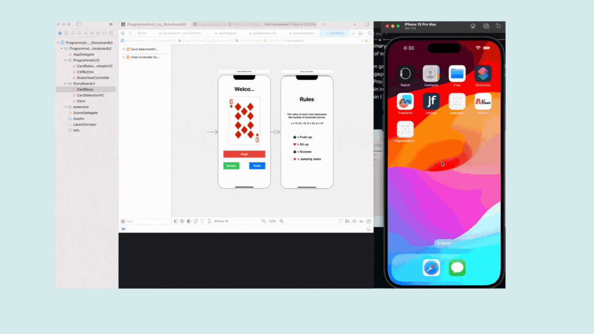
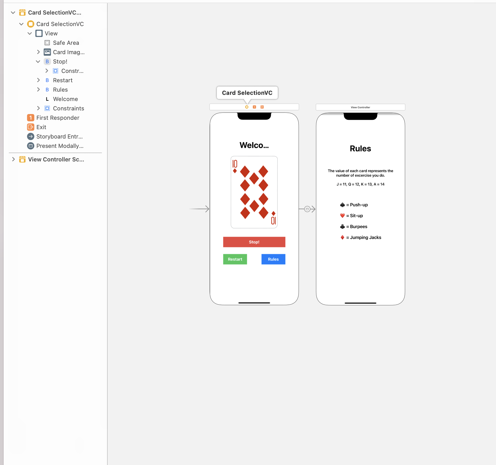

# ProgrammaticUI_vs_StoryboardUI📱
This project serves as a professional demonstration of implementing identical UI using both ProgrammaticUI
```UIKit``` and Storyboard approaches in Swift. Its primary purpose is to showcase the versatility and effectiveness of each method in creating UI components.

# Demo🔥



## Key Features

- Generates random card images for engaging exercises.
- Implements the same UI elements in both Programmatic and Storyboard versions
- Provides a clear comparison of development workflows and code structure

## Benefits for Developers:

- Gain insights into the advantages and disadvantages of each UI development approach
- Understand real-world use cases for ProgrammaticUI and Storyboard
- Compare code maintainability and flexibility between both methods
This project serves as a valuable resource for developers looking to:

- Deepen their understanding of iOS UI development techniques
Make informed decisions on choosing the best approach for their projects


## Programmatic UI 💫

```
    let cardImageView = UIImageView()
    
    // Buttons for controlling the card selection
    let stopButton = CWButton(backgroundColor: .systemRed, title: "Stop!", systemImageName: "stop.circle")
    let resetButton = CWButton(backgroundColor: .systemGreen, title: "Restart", systemImageName: "arrow.clockwise.circle")
    let rulesButton = CWButton(backgroundColor: .systemBlue, title: "Rules", systemImageName: "list.bullet")
    
    // Array to store the deck of cards
    var cards = Deck.allValues
    
    // Timer for automatic card selection
    var timer: Timer!
```
The Programmatic UI version of the application is structured as follows:

- CardSelectionProgrammaticVC.swift: Contains the code for setting up the UI elements and handling user interactions.
- AppDelegate.swift: Entry point of the application, initializes the UIWindow and sets the root view controller.
- SceneDelegate.swift: Handles the scene lifecycle events for iOS 13 and above.
- Assets.xcassets: Contains any image assets used in the application.
Info.plist: Configuration file for the application.

- Add this for use ProgrammaticUi in `SceneDelegate.swift` 
```
guard let windowScence = (scene as? UIWindowScene) else { return }
window = UIWindow(frame: windowScence.coordinateSpace.bounds)
window?.windowScene  = windowScence
window?.rootViewController = CardSelectionProgrammaticVC()
window?.makeKeyAndVisible()
```


## Storyboard ✨
The Storyboard version of the application consists of:



- CardStory.storyboard: Visual representation of the app's user interface.
CardSelectionVC.swift: Contains code for handling logic and interactions related to the UI elements defined in the storyboard.
- AppDelegate.swift: Entry point of the application, initializes the UIWindow and sets the initial view controller.


## Installation ⚡️
To install and run follow these steps:

1. Clone the repository to your local machine:

2. Open the project in Xcode.

3. Build and run the project on your desired iOS device or simulator.

## Author 🙋🏻‍♂️

- [@NirmalsinhRathod](https://github.com/NirmalsinhRathod) 🧑🏻‍💻